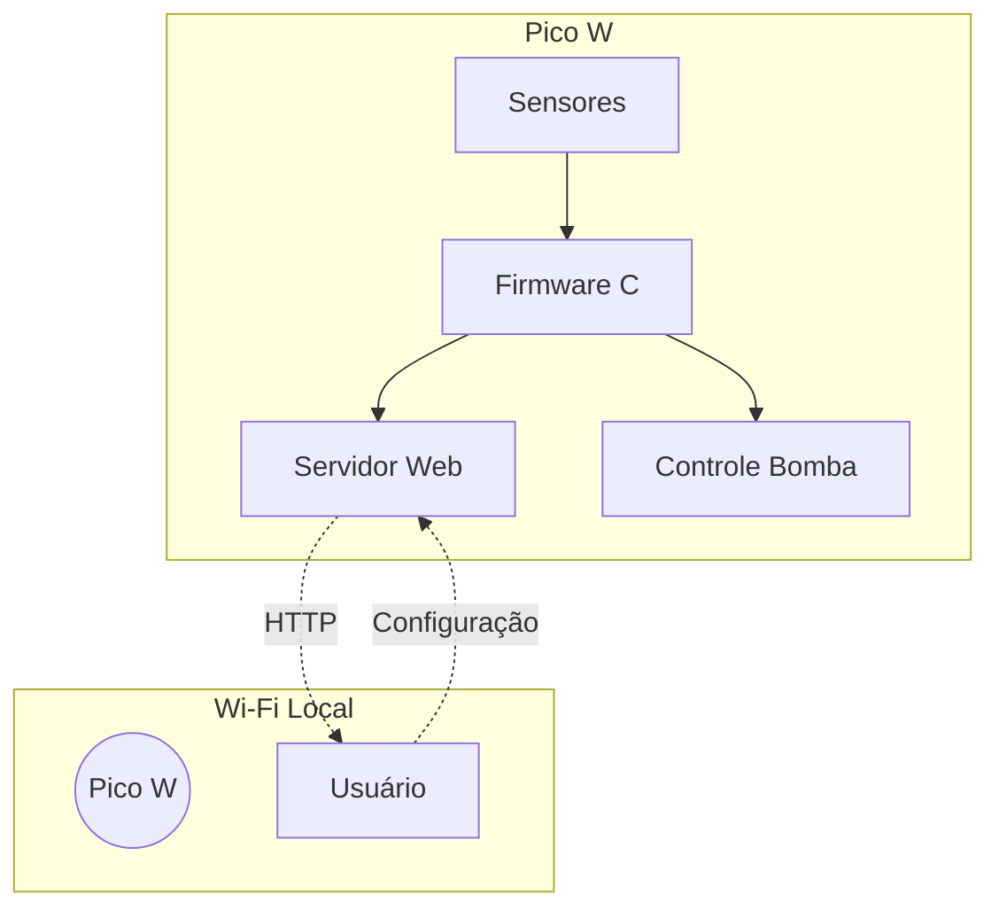

# Sistema de Abastecimento Inteligente com Interface Interativa 💧


**Sistema de Abastecimento Inteligente** é uma solução IoT completa para controle automatizado de reservatórios de água, com interface web integrada. Desenvolvido para **Raspberry Pi Pico W** com baseboard **BitDogLab**, oferece:

* **Controle automático de bomba** baseado em níveis pré-configurados
* **Interface web responsiva** para monitoramento remoto e configuração
* **Sistema de alertas sonoros** para eventos críticos
* **Display OLED integrado** para status local do sistema
* **Calibração física** via botões dedicados
* **Feedback visual** com LEDs indicadores de estado

> Projeto desenvolvido por **Heitor Rodrigues, Luiz Felipe, Paulo César e Roberto Cardoso** - Código aberto sob Licença MIT.
>

## 📺 **Demonstração em vídeo :**      [Assista no YouTube](https://www.youtube.com/watch?v=GipO38Gzfcw&t=42s)

---

## 📂 Estrutura do repositório

| Caminho            | Descrição                                   |
| ------------------ | --------------------------------------------- |
| `main.c`         | Firmware principal com servidor web embarcado |
| `lib/ssd1306.c`  | Driver para display OLED                      |
| `lib/ssd1306.h`  | Header do driver OLED                         |
| `lib/font.h`     | Fonte bitmap para renderização de texto     |
| `CMakeLists.txt` | Configuração de build do projeto            |
| `README.md`      | Documentação do sistema                     |

---

## 🔧 Requisitos

### Hardware

| Componente                        | Qtde | Observação                              |
| --------------------------------- | ---- | ----------------------------------------- |
| **Raspberry Pi Pico W**     | 1    | Com conectividade Wi-Fi integrada         |
| **BitDogLab baseboard**     | –   | Integra botões, display OLED e interface |
| **Sensor de nível (boia)** | 1    | Conectado ao ADC (GPIO 28)                |
| **Módulo relé**           | 1    | Para controle da bomba d'água (GPIO 8)   |
| **LEDs indicadores**        | 2    | Verde (GPIO 16) e Vermelho (GPIO 17)      |
| **Buzzer**                  | 1    | Alertas sonoros (GPIO 10)                 |
| **Fonte 5V**                | 1    | Alimentação do sistema                  |

### Software

| Ferramenta                  | Versão mínima |
| --------------------------- | --------------- |
| **Pico SDK**          | 1.5.0+          |
| **CMake**             | 3.13+           |
| **GNU Arm GCC**       | 10.3‑2021.10+  |
| **Navegador moderno** | Chrome 90+      |

---

## ⚙️ Configuração do sistema

### Passo 1: Compilação do firmware

```bash
# Clonar o repositório
git clone https://github.com/TorRLD/sistema-abastecimento-inteligente.git
cd sistema-abastecimento-inteligente

# Configurar credenciais Wi-Fi
#define WIFI_SSID     "SUA_REDE"
#define WIFI_PASSWORD "SUA_SENHA"

# Compilar o projeto
mkdir build && cd build
cmake .. -DPICO_BOARD=pico_w
make -j$(nproc)

# Gravar no Pico W:
# 1. Pressione BOOTSEL, conecte USB, solte BOOTSEL
# 2. Copie o arquivo .uf2 para a unidade RPI-RP2
```


### Passo 2: Gravação no Pico W

1. Pressione o botão  **BOOTSEL** , conecte o cabo USB
2. Solte o botão e monte a unidade `RPI-RP2`
3. Copie o arquivo `.uf2` gerado na pasta `build/`

### Passo 3: Conexão dos periféricos

| Componente       | GPIO Pico W    |
| ---------------- | -------------- |
| Botão A         | GPIO 5         |
| Botão B         | GPIO 6         |
| Botão C         | GPIO 22        |
| Sensor de nível | GPIO 28 (ADC2) |
| Relé da bomba   | GPIO 8         |
| LED Verde        | GPIO 16        |
| LED Vermelho     | GPIO 17        |
| Buzzer           | GPIO 10        |

---

## 🌐 Acesso à interface web

* Conecte o computador/celular à **mesma rede Wi-Fi**
* Acesse o **IP exibido no display OLED** usando um navegador
* Interface estará disponível na **porta 80**

---

## 🎢️ Operação do sistema

### Controles físicos

| Botão | Função                        |
| ------ | ------------------------------- |
| A      | Calibrar nível mínimo (vazio) |
| B      | Calibrar nível máximo (cheio) |
| C      | Reinício / Modo bootloader     |

### Interface web

* Monitoramento em tempo real do nível da água
* Controle visual do estado da bomba
* Configuração de limites mínimo e máximo
* Feedback visual com barras de progresso
* Sistema de alertas de configuração

---

## 💡 Estados do sistema

| Indicador        | Significado                  |
| ---------------- | ---------------------------- |
| LED Verde        | Bomba em operação          |
| LED Vermelho     | Bomba desligada              |
| Buzzer contínuo | Nível crítico (alto/baixo) |
| Bip triplo       | Calibração bem-sucedida    |

---

## 📡 Arquitetura do sistema



---

## ⚠️ Troubleshooting

| Problema                   | Solução                                   |
| -------------------------- | ------------------------------------------- |
| Wi-Fi não conecta         | Verifique SSID e senha no código fonte     |
| Interface web inacessível | Confirme o IP exibido no OLED               |
| Leituras inconsistentes    | Recalibre o sensor com botões A/B          |
| Bomba não ativa           | Verifique conexão e alimentação do relé |

---

## 🤝 Contribuindo

1. Faça um fork do projeto
2. Crie sua branch: `git checkout -b feat/nova-funcionalidade`
3. Commit: `git commit -m 'Adiciona nova funcionalidade'`
4. Push: `git push origin feat/nova-funcionalidade`
5. Abra um **Pull Request** 🎉

---

## 📝 Licença

Distribuído sob a Licença MIT. Veja o arquivo [LICENSE](LICENSE) para mais detalhes.

---

## 📞 Contato

**Equipe de Desenvolvimento**

🔗 Repositório: [https://github.com/rober1o/sistema_de_abastecimento_hidraulico](https://github.com/rober1o/sistema_de_abastecimento_hidraulico)
